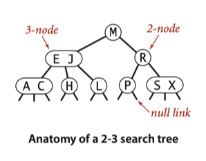

+++
title = "查找-平衡二叉树"
description = ""
date = 2022-01-27T10:42:01+08:00
featured = false
comment = false
toc = false
reward = false
categories = [
  "算法"
]
tags = [
  "search",
  "bst"
]
series = []
images = []
+++

> 本文内容来自 Algorithhms 4th Edition

由于二叉树严重依赖输入的随机性，因此我们需要平衡二叉树（红黑二叉树）来实现能够自动调整树的结构以达到平衡。

### 2-3查找树
在BST中，每个节点都是2-nodes, 也就是说节点只有一个值，其可以有2个字几点，因此在这里引入了3-nodes的概念，即一个节点有两个值，可以有三个子节点。可以想象成3-nodes就是两个2-nodes节点拼在一起。

#### 定义：
一个2-3 查找树中每个节点要不然空，要不然
- 是一个2-nodes: 该节点有一个值和左右两个子节点，左子树也是一个2-3查找树，并且其值都比该节点小，右子树也是一个2-3查找树，并且其值都比该节点大
- 或者是一个3-nodes: 该节点有两个值和三个子节点指针。左右子树根2-nodes一样，中间的子树的值介于该节点两个值之间

一个完全平衡的2-3 查找树就是指其所有的空节点到根的距离都相同。

### 查找
2-3查找树中查找一个值根BST类似，都是递归的方式在对应的子树中去寻找，直至找到（命中）或者到达空节点（未命中）

2-3查找树之所以能自动调整平衡，关键在于当往3-nodes中在加入一个值后其变成4-nodes, 而一个4-nodes可以拆成一个平衡的ts， 即中间的节点作为parent, 两边的节点作为左右自己点。因此对于2-3查找树，其插入，删除的核心都在2-nodes——>3-nodes->4-nodes->最后在分拆
### 插入到2-nodes
当要要插入的节点是个2-nodes时，很简单，将其变为3-nodes即可

### 插入到3-nodes
当将一个值插入到3-nodes时，其变成4-nodes, 此时就要分拆。分拆后，树的高度+1 

### 插入到父节点是2-nodes的3-nodes
由于插入到3-nodes会拆分，新生成的parent向上传递，而父节点是个2-nodes，因此父节点自然就组合成一个新的3-nodes

### 插入到父节点是3-nodes的3-nodes
同理，会向上两次传递。

### 根节点的拆分
如果根节点本身已经是3-nodes, 在被向上拆分的子节点追加后会变成4-nodes, 此时根节点应该拆分，同时树的高度+1

将临时的4-nodes拆分的过程是局部的，也就是说这种变换除了关联的节点及其链接，树的其他部分都不需要修改，因此每次变换我们只需要修改很小的部分，由此可说明当我们发现需要变换的节点时，这种变换时高效的。每次变换时，会将拆分出来的parent以及调整好结构的子树向外层传递。

更重要的是，这种变换保持了树已经排好的顺序，并且保证树仍然是平衡的：也就是说从根到任何一个空节点的距离仍然是相等的。

与BST比较，BST的增长是向下的，我们不断的添加子节点；平衡BST是从底部向上增长的，就是说我们在底部添加一个值，这个过程中如果有4-nodes形成就不断向上拆分，最终使root变成4-nodes,从而达到整个树高度+1

**Proposition F: 查找和插入操作在N个元素构成的2-3查找树中需要访问最多lgN个节点。**

由此，分析2-3树与分析BST是不同的，因为2-3树的目的是为了确保最坏情况下的性能，而BST是分析其平均状况下的性能。在Symbol Table中由于我们没有办法去控制输入，所以分析最坏情况能够对性能做一个保证。

### 红黑二叉树
为了实现2-3 tree，我们引入了红黑二叉树（red-black BST）,即用传统BST的Node结构加上一点额外信息来定义3-nodes：我们用red links 来将3-nodes中的两个元素链接起来，用black links来链接2-3tree中的每个节点。更具体的，我们将3-nodes用两个2-nodes用靠左的red link链接起来来表示。

定义：红黑二叉树就是拥有Red links & Blank Links的BST并且满足如下限制：
- Red links靠左边
- 一个节点不能有两个Red links
- 整个树对于Black Links来说是完美平衡的：每个空链接到根都有相等的Blank Links数

#### 颜色的表达
由于每个节点仅仅与其父节点相连接，我们在节点中增加一个是否是红色的属性，来表示其到其父节点的这个链接是否是Red links。

#### 旋转
在节点不断添加，合并，拆分的过程中，我们会碰到这些情况：Red Links并不靠左；一个节点有两个Red Links。 因此我们需要通过旋转来解决这些问题。旋转包括两种方式：左旋和右旋
- 左旋： 当Red link靠右时，我们需要通过左旋将其转到左边。具体思路如下：当R靠右时，说明子节点是比父节点大的，所以旋转后应该将子节点放在上面，而原来的父节点作为左边的子节点，同时相应的其他调整
- 右旋： 右旋同理，调整前子节点比父节点小，因此要右旋的话，我们应该将子节点放在上面，原来的父节点放在右下
在旋转时，除了挂在的节点要调整外，还有一些信息要调整：
- 无论左旋还是右旋，都是将父，子节点进行颠倒，原先都是子节点中color=Red, 调整后，其变成了父节点，因此color=parent.color, 而原来父节点的color旋转后应该变为Red. (即旋转后，我们仍然保持red link 不变。 只是由于旋转后交换了父子节点，所以color=red的保存也跟着改变了)
- 旋转后，子节点放在了父节点的位置上，因此其n值就是原来父节点的n值，而原来父节点需要通过size(x) = size(left) + size(right) + 1重新计算一遍

### 插入
当我们在红黑树中插入一个新元素，我们一定是插入一个有Red link节点，然后在根据需要调整。
例如一个只有根的树，我们在其左边插入一个节点，由于R靠左，不需要调整；如果插入在其右边，此时我们就需要做一个左旋。
如果我们插入的是一个3-nodes, 那么就可能有三种情况
1. 新插入的值最大，那么就会形成一个中间元素有两个R子节点的情况——这种只需要要将其变成黑色即可
2. 如果插入的值最小，就会形成中间元素的上下都是R的情况，此时我们要将其调整成正三角（上面的样子）——因此我们我们只要对上面的那根R做右旋，然后改变颜色即可
3. 如果插入的值在中间，那就形成了中间的元素向上是R, 右下是R， 因此我们先最右下这个R进行左旋，变成2的样子，再继续操作即可

#### 颜色的翻转
上面1的情况，我们需要做颜色的翻转，即将左右的两条红色变成黑色，Parent的设定成红色即可

#### 保持根的黑色
由于不断插入，最后颜色的翻转可能导致根的颜色是红色，所以我们需要插入元素后重新设定根是黑色的

总结：
从上面1，2，3可以看出，操作是层层递进的。因此在实现中我们可以先检查右节点是否是R，进行左旋，然后检查左子节点及左子节点的子节点是否是红的，做右旋；最后做检查左右是否都是红的，做颜色翻转

### 删除
对于删除，最重要的就是不能破坏其平衡性。如果以2-3树为思考，也就是说如果我们删除的地方是个2-nodes,删除后必然导致其下面的空链接长度改变，破坏了平衡。但是如果删除的位置是个3- nodes，那么即使我们删除掉这个元素，该位置仍然还有其他元素存在，我们只需要重新挂载一下子树就行，不会破坏平衡性。所以删除的核心就是如果能够确保我们在仍和情况下都是删除的3-nodes.

红黑二叉树是通过插入时的拆分来保持平衡，那么在删除时我们就需要先做合并，将2-node合并成3-nodes或者4-node,删除完成后，再将多余的4-nodes重新拆分

如何合并：
- 如果是左右都是2-nodes, 那么不管parent是2-nodes还是3- nodes，我们都可以从parent找一个节点出来，和这两个子节点构成4- nodes，只要将左右link变红即可。
- 如果左右子节点一个是2- nodes， 一个是3- nodes，那么对于要扩展的那一变，我们只需要将parent拿下来和这个2-nodes拼成一个3- nodes，而从另一个3-nodes中取一个节点放到原来parent的位置上

#### 删除最小值
有了上面合并的思路，我们要删除最小值，就意味着我们沿着最左边的一条路径不断做合并到底部，然后删除最小元素，进而原路返回，将路上碰到的4-nodes重新拆分掉
- 如果当前节点的左孩子不是2- nodes，那么什么都不用做，继续向坐下走
- 如果左孩子是个2- nodes，并且其直接兄弟是个3- nodes，那么从3-nodes中移动一个元素，将2-node变成3-nodes
- 如果左孩子及其直接兄弟都是2- nodes，那么将这两个孩子以及parent中最小的元素一起构成一个4-nodes,此时parent将从4-nodes变成3-nodes或者从3-nodes变成2- nodes。

#### 删除任意的值
有了上面删除最小值为基础，当我们删除任意值时，同样的道理，如果最终删除的位置在底部，那么我们直接删除就可以了，如果不是底部，此时我们将这个元素和比他大的最近的元素（即右子树的最小值）做交换。于是我们将问题转化为删除右子树的最小值。

### 分析
**Proposition G: 由N个元素组成的红黑二叉树其高度不高于2lgN**

**Proposition H：由N个元素组成的红黑二叉树从其根到节点的距离大约是～1.00lgN**

由此可见，红黑二叉树平均下来大约比BST快40%左右

