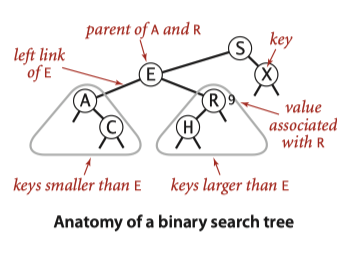
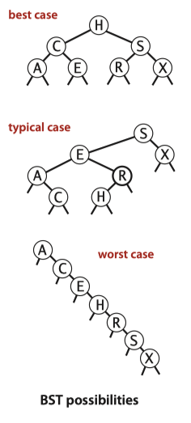
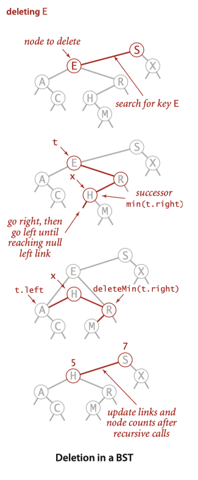
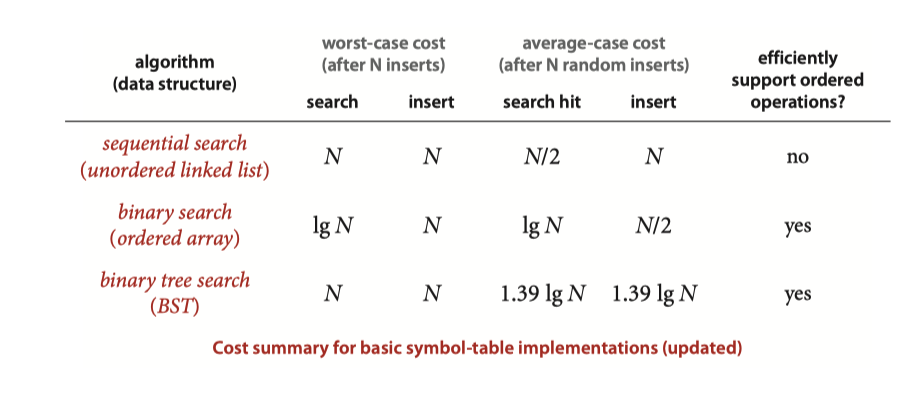

+++
title = "查找-二叉树"
description = ""
date = 2022-01-26T17:25:17+08:00
featured = false
comment = false
toc = false
reward = false
categories = [
  "算法"
]
tags = [
  "search",
  "bst"
]
series = []
images = []
+++

> 本文内容来自 Algorithhms 4th Edition

对于查找，第一个直觉就是先排序，然后再从中找到需要的对象。那么为什么要将查找和排序分开来呢，一个重要的原因是对于查找我们需要一种结构能够保证我们既找的快，有能够不因为插入/删除时耗费大量的时间。

对于符号表(symbol-table)来说，二叉树(Binary Search Trea -- BST)是一种理想的结构。

### 定义
二叉查询树是一种二叉树，其每个节点包含有一个可比较的（Comparable）键值，并且规定任何一个节点的值都比其左子树的值大，比其右子树的值小。



```java
private class Node {
        private final Key key;
        private Value value;
        private Node left, right;
        private int n;

        public Node(Key key, Value value, int n) {
            this.key = key;
            this.value = value;
            this.n = n;
        }
    }
```

要注意的一点： n 记录了当前节点下子节点的数量(包含自身), 因此对于节点x, 其size的公式为
```java
size(x) = size(x.left) + size(x.right) + 1;
```
n的用处在于我们可以通过x.left.n知道当前节点在整个序列中的位置，这对于实现rank等方法非常有用。

### 搜索
二叉查询树的搜索是很直观的，通过递归的方式很好理解：将要查找的key和当前节点的key比较，如果小，则继续在左子树中查询，如果大，则在右子树中查询，如果相等则命中。如果左/右子树为空，则未命中。
如果在整个树中包含某个值，则称为命中（search hit）, 否则叫未命中(search miss)

### 插入
插入同样很简单，从根开始不断向下走（小就走左边，大就走右边），知道走到底部，将节点插入到底部节点的下面就可以了。
这里要注意一下递归： 跟搜索一样，插入也同样使用了递归。我们不断使用递归走到目标所在之处，对于搜索来说，此时我们返回结果，每层递归将传递过来的结果返回出去。但是插入不一样，我们需要更新我们的子树，同时更新我们的节点数n。

### 分析
二叉树的查找时间依赖于树的形状，也就是说依赖于输入的顺序。



当二叉树是完全平衡的，那么其高度大约为～lgN, 在最坏的情况下，其高度为N, 通常情况下，树的形状还是比较接近平衡的。
在许多应用中，我们认为其输入都是随机的，那么分析BST就近似于我们分析QuickSort. 树的根就如同QS中的第一次分段，由此我们得出如下推论：

**Proposition C: 对于随机的N个输入构造的BST, 查找命中平均大约需要～2lnN(也就是1.39lgN)次比较。**
**Proposition D: 插入或者查找未命中对于随机的N个输入构造的BST平均大约需要～2lnN(也就是1.39lgN)次比较**

### 跟顺序有关的其他方法以及删除
BST最重要的特征就是就是允许我们按键值的顺序保存，因此也就提供许多需要基于顺序的方法
#### 最大/最小值
#### Floor /Ceiling
对于Floor，我们递归的比较key与当前节点的键值，如果小于节点，那么在左子树中继续查找，如果相当，那就是这个节点，如果比节点大，那么我们就需要去右子树找，此时存在一种情况，如果右子树中找不到比key小的值，那这个节点就是返回值
Ceiling类似
### select
select 就是查找指定位置的节点。 此时我们就需要利用节点中n的信息。 由于一个节点所处的位置等于其左子树的n + 1, 所以我们将指定的值与左子树的n值比较，如果小，那么继续在左子树的查找，如果大，那么我们转而查找右子树，由于左边已经有n个元素了，所以其实我们在右子树中查找k -n - 1位置的元素。以此类推
### rank
rank 查找元素的排名，仍然是递归的方式，如果key比当前节点小，那么在左子树去查找，如果相当，那么排名就等于小size(x.left), 如果大，那么其排名就是size(x.left) + 其在右子树的排名 + 1
注意一点，rank是从0开始的，而我们的节点的n默认是1（包含自己），所以一个节点的rank就是x.left
### 删除最大/最小节点
删除最小节点是为删除任意节点做准备。 要删除最小节点思路很简单，不断在左子树中找到左子树为空的节点即可。删除时，用该节点的右子树来代替该节点。
### 删除任意节点


删除节点仍然是通过递归先查找该节点。 删除时思路为用该节点右子树的最小节点来代替该节点，所以我们找到其右子树最小节点后问题转化为删除右子树的最小节点。

**Proposition E: 对于BST, 在最坏的情况下，任何操作所需要的时间跟树的高度成正比。**

### 总结
BST实现比较容易，同时如果输入时比较随机的话能够提供很好的查询和插入效率。同时BST也提供了快速的rank, select, delete ,range query等方法，因此也受到欢迎。同时也要强调，其性能深受输入顺序的影响，在比较坏的情况下可能无法达成预期。 与快速排序比较，我们可以在快速排序前对数组先做一次随机操作，但是对于symbol table, 我们没办法这样做。

因此我们需要引入平衡二叉树。



