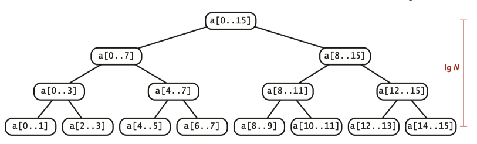

+++
title = "排序-合并排序"
description = ""
date = 2022-01-12T15:03:34+08:00
featured = false
comment = false
toc = false
reward = false
categories = [
  "算法"
]
tags = [
  "sort"
]
series = []
images = []
+++

> 本文内容来自 Algorithhms 4th Edition

### 实现
这个算法的基本思想是合并：将两个排好序的数组合并成一个数组。
因此合并排序简单来说就是将一个数组分成两半，递归的将两半各自排好序，再将其合并成一个大的数组。 合并排序最重要的一个特点就是能保证执行时间是NlogN。缺点是需要跟N成比例的额外的空间。

要实现合并排序，最直接的就是实现将两个数组合并成一个数组的方法：额外创建一个数组，从两个数组中不断取最小的对象放到这个存放数组中。
当要对一个大数组进行合并排序时，我们需要做大量的合并操作，因此每次创建新数组去保存结果也是一笔不小的开销。因此，如果能够直接在数组上操作，可以大大减小开销————想起来很简单，实现起来很复杂，特别是跟用额外数组做合并的方式比较起来的话。
```java
public static void merge(Comparable[] a, int lo, int mid, int hi) { 
    // Merge a[lo..mid] with a[mid+1..hi].
    int i = lo, j = mid+1;
    for (int k = lo; k <= hi; k++) // Copy a[lo..hi] to aux[lo..hi].
        aux[k] = a[k];

    for (int k = lo; k <= hi; k++) // Merge back to a[lo..hi].
        if (i > mid)                    a[k] = aux[j++];
        else if (j > hi )               a[k] = aux[i++];
        else if (less(aux[j], aux[i]))  a[k] = aux[j++];
        else                            a[k] = aux[i++];
}
```

### 自顶而下的合并
上面的实现是著名的分治的例子：如果对两个子数组排序，那么将两个数组合并后就相当于对整个数组排序了。
要理解合并排序，需要理解调用的过程。假设排序a[0...15], 需要调用a[0...7] ->a[0...3] ->a[0...1] 从而调用merge(0, 1), 然后继续调用a[2...3] 调用merge(2,3)如此反复。 我们可以看出，**sort通过递归，提供了一组调用merge的顺序组，排序是通过不断的merge来实现的，而sort则指导什么时候对什么数组进行merge。**

Proposition F: 对于长度为N的数组，自顶而下的合并排序使用1/2NlgN ～ NlgN之间次数的比较
证明：假设C(N)代表对长度为N的数组排序所需要的比较次数，我们有`C(0)=C(1)=0`。对于N>0,我们按照递归的思路，可以得到`C(N)<= C(N/2) + C(N/2) + N`, 其中第一个C(N/2)代表做半部排序的次数，第二个代表右半部的次数。 同时还有`C(N) >= C(N/2) + C(N/2) + N/2`, 这里N/2代表左半部（我们至少要比较一半）
如果N = 2<sup>n</sup>, 那么左半部和右半部都是2<sup>n-1</sup>。 由此我们推导出 C(2<sup>n</sup>) = 2C(2<sup>n-1</sup>) + 2<sup>n</sup> (后面略)

换一种方式来理解Proposition F



#### 优化
对上面算法可以继续优化
- 由于对小数组，插入排序是高效的，因此我们当递归到小数组（比如长度小于15）时，我们可以用插入排序来替代
- 在合并两个数组前先检查左半部的最后一个对象是否刚好小于等于右半部的第一个对象，如果是，我们就不用挨个比较了
- 消除额外的数组复制。 我们合并时，要不然先将对象复制到一个数组，然后合并回来，要不然将对象合并到一个数组，再复制回来。因此如果我们能够在一次合并时，将一个数组作为输入，一个作为输出，下次合并时将输出的数组作为输入，就能够减少一次复制

注意：以上的优化不是必须的，因为优化往往伴随着代码的复杂。解决一个问题时，我们应该首先选用最简单的办法，当遇到性能瓶颈时再考虑优化他。

### 自下而上的合并
对于分治的思想，由于最终都是将大问题逐渐分解成最小的问题，所以我们可以自下而上，即现两个两个合并，然后四个四个合并，直到整个数组的合并。

对于长度为2的幂的数组，自顶而下 和 自下而上效率时相同的，只是顺序相反， 但是其他长度则可能有效率上的差距

### 排序算法的复杂度
学习合并算法的一个重要原因是因为通过他我们可以推导出排序算法的复杂度，即排序算法的极限。 研究算法的复杂度就是建立一个算法的计算模型。 对于以比较为基础的排序算法（插入，选择，合并排序都是此类， 还有不用通过比较来排序的算法），关键制约是：
1. 可以处理任意多的输入
2. 我们除了在比较时能够知道两个对象的key之外得不到其他任何key的信息
Prop I. 没有以比较为基础的排序算法可以做到比较的次数少于lg(N!) ~ NlgN
